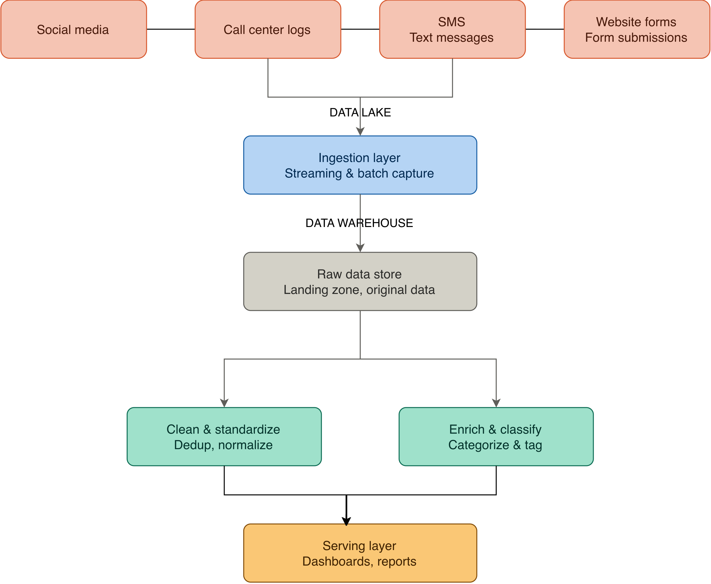

# Conceptual data pipeline — Beejan Technologies

This document describes the conceptual design for a data pipeline that unifies customer complaint data from 4 sources (social media, call center logs, SMS, and website forms), and turns it into a single, trustworthy source for reporting.

# 1. Source identification

Four source types are in scope, each with a different shape and cadence:
| Source | Type | Format | Frequency |
|---|---|---|---|
| Social media | Public posts & mentions | Semi-structured JSON (API response) | Streaming / near real-time |
| Call center | Agent notes & call transcripts | Files (CSV / text exports) | Batch (end of shift or daily) |
| SMS | Customer text messages | Structured text export | Streaming / near real-time |
| Website forms | Web form submissions | Structured (form fields, JSON) | Near real-time to small batches |

Note: All the sources can be ingested as batch or real-time depending on the business requirements

# 2. Ingestion strategy

| Source | Ingestion Method | Real-Time Handling |
|---|---|---|
| Social media | API ingestion (platform API) | Continuous event capture — each post/mention picked up as it happens |
| Call center | File uploads (exported logs) or API ingestion, depending on system capability | N/A — not real-time, batch is acceptable |
| SMS | API ingestion (telecom gateway) | Continuous event capture — each message picked up as it arrives |
| Website forms | API ingestion (direct submission to intake endpoint) or could be files in a data lake | Continuous event capture — each submission picked up as it happens |

# How will real-time data (e.g. Twitter) be handled?

Social media and SMS are the two sources that likely need real-time handling. Both are treated as continuous streams: each new post, mention, or message is captured as an individual event as it happens, tagged with source, timestamp, and a unique record ID, and pushed into the ingestion layer right away — rather than waiting for a scheduled pull. That's what lets the pipeline surface something like a spike in network complaints while it's still unfolding.

# 3. Processing and transformation

Two transformation concerns are kept conceptually separate so each can evolve independently:

(a) Cleaning and standardization — deduplicating repeated complaints (e.g. a customer who tweets and also calls), normalizing timestamps and languages, validating that required fields are       present and manny more as required

(b) classification — assigning each complaint to a category, scoring sentiment using AI or ML

Assumption: complaint categorization is done with an automated classification model rather than manual tagging, since manual tagging cannot keep pace with thousands of daily complaints; a manual review queue handles low-confidence cases.

# 4. Storage options

Both a data lake and a data warehouse are used, because they serve different needs. The data lake is the raw/landing zone that stores every record exactly as ingested (for audit and reprocessing). The warehouse holds the curated data reshaped into aggregated, query-ready tables, optimized for the dashboards and ad-hoc SQL that the reporting team already relies on.

# 5. Serving

The serving layer exposes the curated data through two paths: pre-built dashboards and scheduled reports for management and the reporting team, and a query/API layer for analysts or other internal systems that need on-demand access (for example, a customer service tool that wants to show a caller's recent complaint history). Access is read-only at this layer — no downstream consumer writes back into the pipeline.

# 6. Orchestration and monitoring

The pipeline runs on a schedule that matches each source's cadence: continuous processing for the streaming sources, and a scheduled batch run (e.g. hourly) that picks up file-based sources and pushes everything through cleaning, enrichment, and storage together. A monitoring layer watches every stage for two kinds of failure: pipeline failures (a stage stops running or errors out) and data quality failures (e.g. a sudden drop in volume, or a spike in unclassified complaints), and raises alerts to the data engineering team so issues are caught before they reach a report.

# 7. DataOps

Conceptually, the pipeline is expected to run in a managed, cloud-hosted environment, with separate development and production environments so changes can be tested safely. Pipeline logic is version-controlled, and promotion from development to production follows a review step. 

# Design choices
Ingestion method varies by source, not one-size-fits-all — API ingestion for social media, SMS, and website forms; file uploads for call center logs (or API ingestion if the call center system exposes one). Social media and SMS are treated as continuous streams so real-time spikes are visible within minutes; call center and forms don't need that.

Cleaning and classification are kept as separate stages, not one combined step — standardization rules (dedup, normalize, validate) change rarely, while classification/sentiment logic (AI/ML-driven) is expected to be tuned often. Keeping them apart means one can evolve without touching the other.

Storage is sequential: raw → curated lake → warehouse, not two parallel destinations. The lake holds full-grain cleaned/enriched data (cheap, format-agnostic, reusable for more than just reporting); the warehouse holds a reshaped, aggregated subset loaded from the lake, built specifically for dashboards and ad-hoc SQL.

Every record is tagged with source, ingestion timestamp, and a unique ID at the point of ingestion — this is what makes it possible to trace a complaint back to its origin later, and to reprocess cleanly if logic changes.

Serving is read-only — downstream consumers (dashboards, APIs, other internal tools) query curated data; nothing writes back into the pipeline from that layer.

# Assumptions / thought process
Near-real-time (minutes) is an acceptable definition of "real-time" for this use case — sub-second processing isn't required for complaint handling.

Classification can be automated (AI/ML) for the majority of complaints, with a manual review queue for low-confidence cases, since manual tagging can't keep pace with thousands of daily complaints.

Call center data is available as structured/semi-structured exports (or via an API), not raw audio.

Customer identity can be resolved well enough across channels to deduplicate and enrich (e.g. via phone number or account ID).

Keeping a curated lake stage is worth it because there's more than one downstream consumer of curated data (reporting today, potentially ML retraining or ad-hoc analysis later) — if dashboards/SQL were the only consumer, going straight from cleaning into the warehouse would be a reasonable simplification instead.

# Challenges or unknowns
Identity resolution — matching the same customer across social media, SMS, calls, and web forms isn't always reliable; the matching strategy (phone number, account ID, fuzzy matching) still needs to be defined.

Classification accuracy — an AI/ML model will misclassify some complaints; acceptable error rate and the design of the manual review queue are undefined.

Multilingual content — complaints may arrive in multiple languages, affecting both cleaning and classification.

Data volume growth — the design assumes today's volumes; a spike (e.g. a network outage driving a surge in complaints) needs to be absorbed without backing up the pipeline.

Privacy and retention — how long raw complaint data (which may contain personal information) should be retained isn't yet defined, and who has access to which layer (raw vs. curated vs. warehouse) needs governance rules.

Call center ingestion path — whether file export or API ingestion is used depends on a system capability that isn't confirmed yet.

Key assumptions
Near-real-time (minutes) is sufficient; sub-second latency is not a requirement.
An automated classification model can categorize the majority of complaints, with a manual queue for edge cases.
Call center data is available as structured or semi-structured file exports, not raw audio.
Customer identity can be resolved across channels well enough to deduplicate and enrich (e.g. via phone number or account ID).
Data volumes are large enough to justify a lake plus warehouse split, rather than a single store.
Challenges and open questions
Identity resolution — matching the same customer across social media, SMS, calls, and web forms is not always reliable and needs a defined matching strategy.
Classification accuracy — automated categorization will misclassify some complaints; the acceptable error rate and the design of the manual review queue still need to be defined.
Multilingual content — complaints may arrive in multiple languages, which affects both cleaning and classification.
Data volume growth — the design assumes today's volumes; a large spike (e.g. a network outage causing a surge in complaints) needs to be handled gracefully rather than causing pipeline backlog.
Privacy and retention — how long raw complaint data (which may contain personal information) should be retained is not yet defined.
Other notes

This design intentionally keeps raw and curated data separate so that if the classification or cleaning logic changes later, historical raw data can be reprocessed without needing to re-collect it from the original sources. The same reasoning is why cleaning and enrichment are shown as two distinct steps rather than one: standardization rules change rarely, while classification/enrichment logic is expected to be tuned often.
